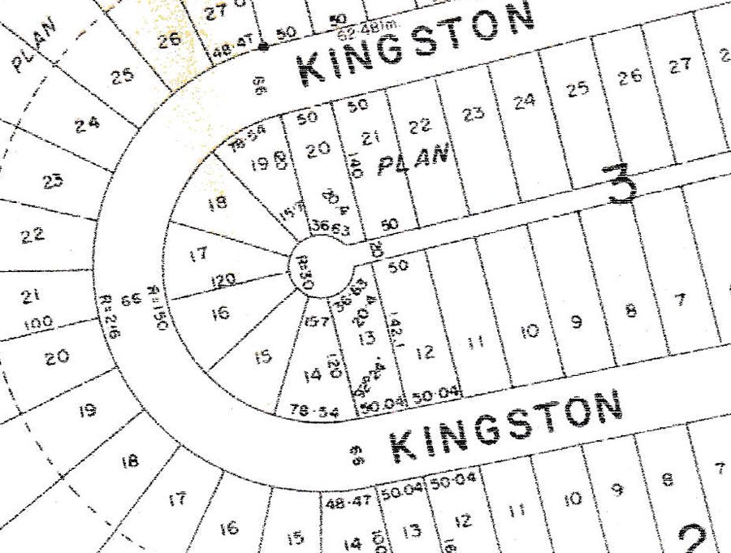
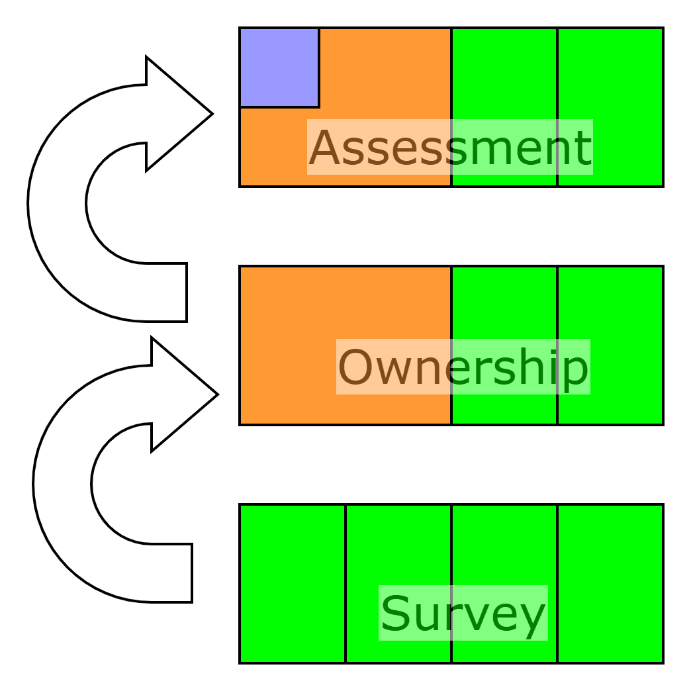

# Overview

Backsight is a data entry mechanism for producing cadastral map data from hardcopy survey plans, and was originally developed in the
late 1990s for the Canadian province of Manitoba. Some of these plans date back to the 19th century, and show thedistances and angles
that were used to subdivide the land.

# Basic Requirements

## Data Entry

Backsight should make it easy to convert old survey plans into digital maps, while also preserving the original observation details
found on the hardcopy plans. For example, a survey plan may indicate that a point was positioned having turned a 90 degree angle with
respect to a reference point. Or you may have a line that has been laid out exactly parallel to another line.

## Updates

The original observations (distances and angles) should act as constraints that are taken into account during
any sort of update. Two types of update will be supported:

1. Corrections to previously entered observations (e.g. a poorly reproduced 5 has to be changed to a 6)
2. Adjustments to ground control points (e.g. see [this](https://www.ngs.noaa.gov/datums/newdatums/what-to-expect.shtml))

Updates will be used to recalculate the geometry for all spatial objects that are ultimately dependent on the change.
The software will be allowed to scale the dimensions of lines, but must continue to honour observed angles and offset distances.

Comparing the adjusted length of each line with the originally observed length will provide a way to confirm that the update continues
to achieve an acceptable precision.

## Derived Layers

While a parcel appearing on a survey plan will frequently have a specific owner, this is not always the case.
Someone may well sell their property (or some portion of it) to their neighbour, leading to property boundaries
that no longer coincide with the original plans. This can complicate matters if land survey and property ownership
are handled by different government agencies. Some amount of coordination is needed to ensure that changes are
correctly conveyed from one department to another.

A further complication arises because different portions of a single property may be assessed differently for
the purpose of taxation. For example, a large supermarket car park may contain a forecourt area that is
subject to a different tax rate.

A hierarchy of map layers will be used to deal with this, as shown below.

It must be possible to propagate changes made on the survey layer to the ownership layer, and then
to the tax assessment layer. Changes going the other way must not be permitted.

# Implementation

## Background

Backsight was originally implemented in C++ as a WinForms application, and worked with data files that were persisted using a package called [PSE](https://www.yumpu.com/en/document/read/36607053/pse-pro-for-c-tutorial/9) (a lightweight rendition of an object database). Completed maps were
then converted into more traditional data formats (Shapefile and DXF) before being uploaded to [this](https://mli.gov.mb.ca/cadastral/index.html)
public-facing web site.

This code repository is a C# rewrite of the original C++ codebase. While the software still retains the WinForms look-and-feel, the dependence on PSE has been eliminated. Instead of working with data files that hold points, lines, and polygons, the software now works with JSON-like files that only hold the data entry commands used to construct the map. When the application starts up, each data entry command gets replayed, which regenerates the geometry of the spatial objects. The geometry remains transient, existing in memory only while the application is running.

## Roadmap

The current system will only run on Windows platforms running NET4, and makes use of a local SQLExpress database that holds ancillary details.
Setting things up is a bit complicated, so I am looking to  rework the codebase to make it more accessible. I expect to do this in 3 phases:

1. Re-target the system to net10.0-windows
2. Replace the SQLExpress database with SQLite (making use of [RepoDB](https://repodb.net/))
3. Eliminate dependencies on Windows by moving to MAUI, and target net10.0

